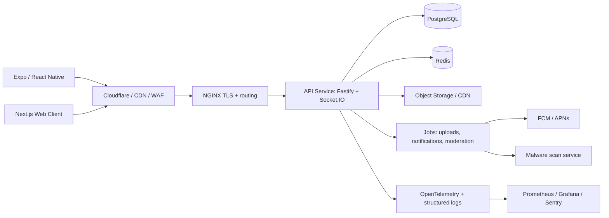

# PL CHAT Production Architecture

PL CHAT is moving from a preview app into a public realtime chat platform. This document is the production target: scalable chat, secure identity, resilient realtime delivery, media handling, moderation, observability, and deployment.

## System Shape

## Core Services

- `apps/api`: authenticated REST API, Socket.IO gateway, session management, moderation hooks, admin endpoints.
- `apps/mobile`: existing Expo app, later refactored into feature modules and API client.
- `apps/web`: future Next.js public web client and admin dashboard.
- `infra`: Docker, NGINX, Kubernetes, monitoring, backup, deployment templates.

## Realtime Rules

- Clients authenticate the socket handshake with a short-lived JWT access token.
- Each socket joins `user:{userId}` and `room:{roomId}` channels after membership validation.
- Every client message carries an idempotency key to prevent duplicate sends during reconnect.
- Server writes the message to PostgreSQL first, then emits canonical events.
- Redis adapter is required before horizontal scaling so multiple API pods share room broadcasts.
- Heartbeat and rate limits protect against reconnect storms and socket flooding.

## Security Baseline

- Passwords use Argon2id.
- Refresh tokens are rotated and stored hashed.
- Access tokens are short-lived and audience-scoped.
- API uses secure headers, CORS allow-listing, request size limits, rate limits, and input validation.
- File uploads are validated by MIME, extension, size, and malware scan workflow before public delivery.
- E2EE-ready fields are present: encrypted payload, sender key id, room key version, and ciphertext metadata.
- Moderation and admin actions are audited.

## Scaling Baseline

- PostgreSQL stores durable identity, rooms, membership, messages, attachments, reports, sessions, and analytics events.
- Redis stores ephemeral presence, typing state, socket fanout, short-lived OTP, rate-limit counters, and queues.
- Media goes to object storage and CDN, not through the API process.
- Message pagination uses indexed cursor queries by `roomId`, `createdAt`, and `id`.
- Hot paths avoid unbounded room scans and large payload broadcasts.

## Production Milestones

1. Backend foundation: schema, auth, sessions, room membership, message CRUD, websocket send/read/typing.
2. Mobile integration: API client, token refresh, reconnect, offline queue, cached messages.
3. Media pipeline: signed upload URLs, thumbnail jobs, scan status, CDN delivery.
4. Notifications: FCM/APNs device tokens, unread counters, background delivery.
5. Admin and moderation: reports, user actions, room locks, audit logs.
6. Observability and deployment: CI, Docker, Kubernetes, backups, monitoring alerts.
